 

---

## 📑 Contents

| `whoami` | `tech_stack` | `github_stats` | `snake` | `connect` |
|:--------:|:------------:|:--------------:|:-------:|:---------:|
| [About](#-whoami) | [Stack](#-tech_stack) | [Stats](#-github_stats) | [Snake](#-contribution_snake) | [Say hi](#-connect) |

---

## `> whoami`

I'm a developer who builds full-stack web applications with the **MERN stack**, with a strong focus on backend systems and APIs. I also explore **blockchain development** — smart contracts, decentralized apps, and Web3 integrations.

I care about **understanding before using** — no black boxes, no tools stitched together blindly. I like building things that work cleanly under the hood, not just on the surface.

<b>💬 Ask me about</b>

MongoDB · Express.js · React · Node.js · REST APIs · Backend Architecture · Blockchain · Solidity

<b>🧠 Currently exploring</b>

- Smart contract design patterns and gas optimization
- Scaling backend services beyond a single Node process
- Clean, testable API layers that stay easy to reason about

<b>⚡ Fun facts</b>

- I read the source instead of guessing the behaviour
- I refactor something every single day
- Green terminal, dark editor, always

---

## `> tech_stack`

<b>🟨 Languages</b>

<b>⚛️ Frontend</b>

<b>⚙️ Backend & APIs</b>

<b>🗄️ Databases</b>

<b>🔗 Blockchain</b>

<b>🔁 CI/CD & Version Control</b>

<b>🧰 Tools</b>

---

## `> github_stats`

 

<b>🏆 Trophies</b> — consistency over everything

---

## `> contribution_snake`

*watch the contributions crawl — every commit counts*

> The snake animation is regenerated daily by [`.github/workflows/snake.yml`](.github/workflows/snake.yml).

---

## `> connect`

Open to collaborating on full-stack and backend projects, open source, and hackathons.
If you're building something real, or just want to talk tech — reach out.

Thanks for stopping by — hope you found something worth your time.

